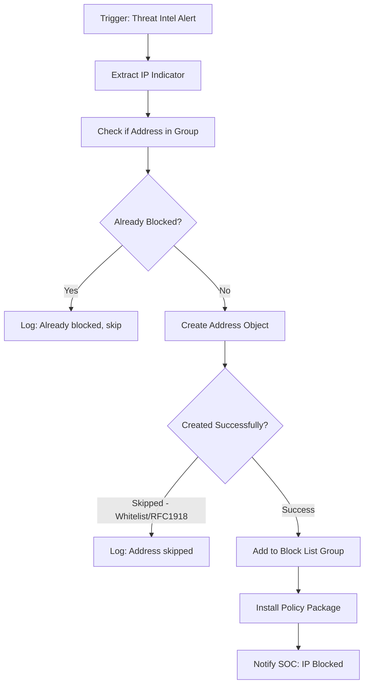
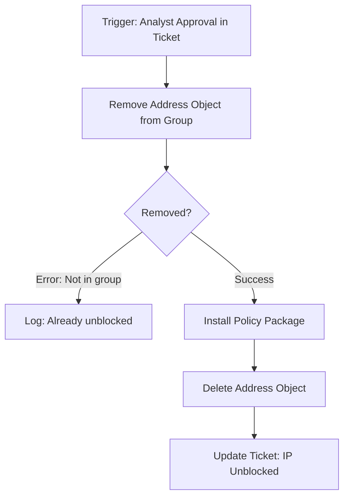
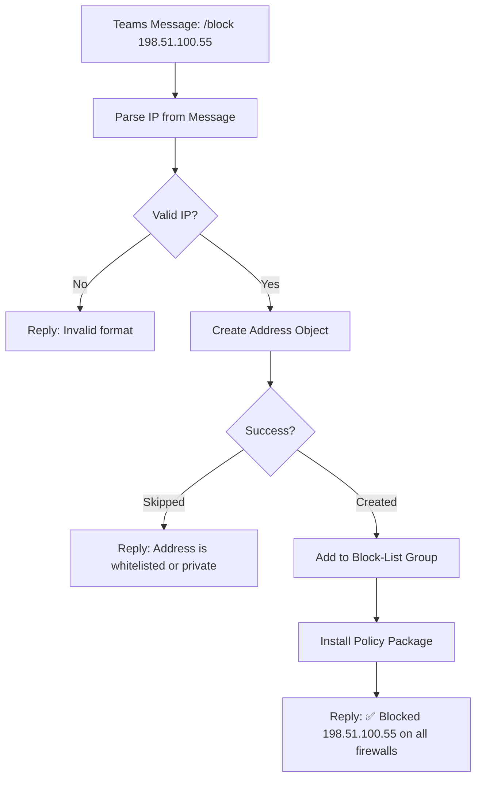
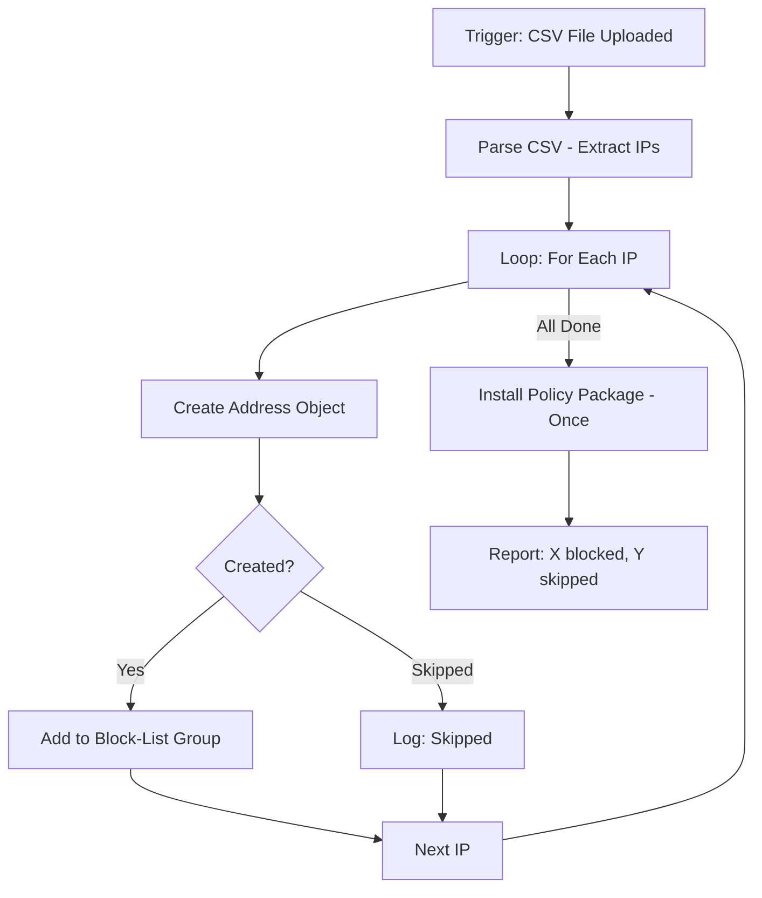

# Fortinet FortiManager Plugin for InsightConnect

## Overview

The Fortinet FortiManager plugin enables InsightConnect SOAR workflows to manage address objects, address groups, and firewall policies through FortiManager's JSON-RPC API. It provides centralized control over multiple FortiGate firewalls from a single management point, allowing automated threat response workflows to block malicious IPs, manage firewall rules, and push policy updates across your entire Fortinet fleet.

### Supported Versions

- FortiManager 7.0.x
- FortiManager 7.2.x
- FortiManager 7.4.x

### Key Capabilities

- Create, delete, and list address objects (IP, CIDR, FQDN)
- Add and remove address objects from address groups
- Check if an address exists in an address group
- Retrieve firewall policies from policy packages
- Install (push) policy packages to managed FortiGate devices

---

## Prerequisites

Before configuring the plugin, ensure the following requirements are met:

| Requirement | Details |
|-------------|---------|
| FortiManager Version | 7.0 or later |
| Authentication | API Token (recommended, requires 7.2.2+) or admin username/password |
| Network Access | HTTPS (port 443) from the InsightConnect orchestrator to FortiManager |
| ADOM Configuration | At least one Administrative Domain (ADOM) configured |
| Permissions | The API user or admin account must have read/write access to the target ADOM's address objects, groups, and policy packages |

---

## FortiManager Setup

### Option A: API Token Authentication (Recommended)

API Token authentication is available in FortiManager 7.2.2 and later. It is the recommended method because it avoids session slot exhaustion and requires no login/logout lifecycle management.

#### Step 1: Create a REST API Admin User

1. Log in to the FortiManager GUI
2. Navigate to **System Settings > Admin > Administrators**
3. Click **Create New**
4. Set the following:
   - **Username**: A descriptive name (e.g., `insightconnect-api`)
   - **Admin Type**: REST API Admin
   - **Admin Profile**: Assign a profile with appropriate permissions (at minimum: read/write to Firewall Objects, Policy Packages, and Device Manager)
   - **Trusted Hosts**: (Optional) Restrict to the InsightConnect orchestrator IP for security
5. Click **OK** to save

#### Step 2: Generate the API Token

1. After creating the admin user, select the user from the list
2. Click **Generate** next to the API Key field
3. Copy and securely store the token — it will only be displayed once

#### Step 3: Verify Permissions

The API token user's admin profile must include:

| Permission Area | Required Access |
|----------------|----------------|
| Firewall Objects (Address, Address Group) | Read/Write |
| Policy Packages | Read/Write |
| Device Manager | Read (for install operations) |
| System Settings | Read (for connection test) |

### Option B: Session-Based Authentication (Legacy)

For FortiManager versions prior to 7.2.2, or if API tokens are not available in your environment.

#### Requirements

- A local admin account with appropriate permissions
- Note: FortiManager limits concurrent sessions to 32 per user. Heavy workflow usage with session-based auth may exhaust this limit.

#### Recommended Practices

- Create a dedicated admin account for InsightConnect (do not share with human users)
- Assign the minimum required permissions
- Monitor session usage if running many concurrent workflows

---

## Plugin Connection Configuration

### Connection Parameters

| Parameter | Type | Required | Default | Description |
|-----------|------|----------|---------|-------------|
| Hostname | String | Yes | — | FortiManager hostname or IP address. Supports FQDN, IP, or FQDN:port format |
| Authentication Type | Enum | Yes | API Token | Choose "API Token" (recommended) or "Session-Based" |
| API Key | Credential | No* | — | The API token value (*required when Authentication Type is "API Token") |
| Username | String | No* | — | Admin username (*required when Authentication Type is "Session-Based") |
| Password | Credential | No* | — | Admin password (*required when Authentication Type is "Session-Based") |
| SSL Verify | Boolean | Yes | false | Validate the FortiManager TLS certificate. Set to `true` in production with trusted certificates |
| ADOM | String | Yes | root | Default Administrative Domain name. Can be overridden per-action |

### Configuration Steps in InsightConnect

1. Navigate to **Plugins** in InsightConnect
2. Search for "Fortinet FortiManager"
3. Click **Add Connection**
4. Fill in the connection parameters:

**For API Token auth:**
```
Hostname:            fortimanager.example.com
Authentication Type: API Token
API Key:             <your-api-token>
SSL Verify:          false (or true with valid cert)
ADOM:                root
```

**For Session-Based auth:**
```
Hostname:            fortimanager.example.com
Authentication Type: Session-Based
Username:            insightconnect-admin
Password:            <your-password>
SSL Verify:          false (or true with valid cert)
ADOM:                root
```

5. Click **Test Connection** to validate
6. Save the connection

### Connection Test Behavior

The connection test validates:
- **API Token**: Calls `/sys/status` with the Bearer token to verify the token is valid and the host is reachable
- **Session-Based**: Performs a login/logout cycle to verify credentials work

### Troubleshooting Connection Failures

| Error | Cause | Resolution |
|-------|-------|------------|
| Invalid credentials | Wrong API key or username/password | Regenerate token or verify credentials in FortiManager GUI |
| Host unreachable | Network connectivity issue | Verify the orchestrator can reach FortiManager on port 443. Check firewall rules and DNS |
| SSL certificate validation failed | Self-signed or untrusted certificate | Set SSL Verify to `false`, or install the CA certificate on the orchestrator |
| No permission | Insufficient admin profile | Update the admin profile to include required permissions |

---

## Actions Reference

### 1. Get Address Objects

Retrieve address objects from a FortiManager ADOM with optional filtering.

#### Inputs

| Parameter | Type | Required | Description |
|-----------|------|----------|-------------|
| Name Filter | String | No | Filter by address object name (case-insensitive exact match) |
| Subnet Filter | String | No | Filter by subnet value (case-insensitive exact match) |
| FQDN Filter | String | No | Filter by FQDN value (case-insensitive exact match) |
| ADOM | String | No | Override the default ADOM from the connection |

#### Outputs

| Parameter | Type | Description |
|-----------|------|-------------|
| Address Objects | []address_object | List of matching address objects |

#### Behavior

- When no filters are provided, all address objects in the ADOM are returned
- When multiple filters are provided, they are combined with AND logic (all must match)
- Returns an empty list (not an error) when no objects match
- Raises an error if the specified ADOM does not exist

#### Example Usage

```
Action: Get Address Objects
Inputs:
  Name Filter: malicious-host-1
  ADOM: (leave empty to use connection default)

Output:
  address_objects: [
    {
      "name": "malicious-host-1",
      "type": "ipmask",
      "subnet": "198.51.100.100/32"
    }
  ]
```

---

### 2. Create Address Object

Create a new address object in a FortiManager ADOM. Supports automatic address type detection, whitelist filtering, and RFC 1918 private address skipping.

#### Inputs

| Parameter | Type | Required | Default | Description |
|-----------|------|----------|---------|-------------|
| Address | String | Yes | — | IP address, CIDR notation, or FQDN to create |
| Address Object Name | String | No | — | Custom name. If empty, the address value is used as the name |
| Whitelist | []String | No | — | Addresses that should NOT be blocked. Skips creation if matched |
| Skip RFC 1918 | Boolean | Yes | true | Skip creation for private IPs (10/8, 172.16/12, 192.168/16) |
| ADOM | String | No | — | Override the default ADOM |

#### Outputs

| Parameter | Type | Description |
|-----------|------|-------------|
| Success | Boolean | `true` if created, `false` if skipped (whitelist or RFC 1918) |
| Address Object | address_object | Details of the created object (empty if skipped) |

#### Address Type Auto-Detection

| Input Format | Detected Type | Stored As |
|-------------|---------------|-----------|
| `198.51.100.100` | ipmask | `198.51.100.100/32` |
| `198.51.100.0/24` | ipmask | `198.51.100.0/24` |
| `malicious.example.com` | fqdn | `malicious.example.com` |

#### Whitelist Matching Logic

| Address Type | Whitelist Match Method |
|-------------|----------------------|
| IP / CIDR | Subnet containment (e.g., `8.8.8.8` matches whitelist entry `8.8.8.0/24`) |
| FQDN | Case-insensitive exact match |

#### Example Usage

```
Action: Create Address Object
Inputs:
  Address: 198.51.100.55
  Address Object Name: threat-indicator-001
  Whitelist: ["10.0.0.0/8", "trusted.example.com"]
  Skip RFC 1918: true
  ADOM: (leave empty)

Output:
  success: true
  address_object: {
    "name": "threat-indicator-001",
    "type": "ipmask",
    "subnet": "198.51.100.55/32"
  }
```

---

### 3. Delete Address Object

Delete an address object from a FortiManager ADOM.

#### Inputs

| Parameter | Type | Required | Description |
|-----------|------|----------|-------------|
| Address Object | String | Yes | Name of the address object to delete |
| ADOM | String | No | Override the default ADOM |

#### Outputs

| Parameter | Type | Description |
|-----------|------|-------------|
| Success | Boolean | `true` if deletion was successful |

#### Important Notes

- Raises an error if the object does not exist
- Raises an error if the object is referenced by an address group or policy (remove it from groups first)

---

### 4. Add Address Object to Group

Add an address object to an address group. This operation is idempotent — adding an object that is already a member returns success without creating duplicates.

#### Inputs

| Parameter | Type | Required | Description |
|-----------|------|----------|-------------|
| Address Object | String | Yes | Name of the address object to add |
| Group | String | Yes | Name of the address group |
| ADOM | String | No | Override the default ADOM |

#### Outputs

| Parameter | Type | Description |
|-----------|------|-------------|
| Success | Boolean | `true` if the operation succeeded |
| Address Objects | []String | Updated list of all member names in the group |

#### Behavior

- If the address object is already in the group, the current member list is returned without modification
- Raises an error if the group does not exist
- Raises an error if the address object does not exist in the ADOM

---

### 5. Remove Address Object from Group

Remove an address object from an address group.

#### Inputs

| Parameter | Type | Required | Description |
|-----------|------|----------|-------------|
| Address Object | String | Yes | Name of the address object to remove |
| Group | String | Yes | Name of the address group |
| ADOM | String | No | Override the default ADOM |

#### Outputs

| Parameter | Type | Description |
|-----------|------|-------------|
| Success | Boolean | `true` if removal succeeded |
| Address Objects | []String | Updated list of remaining member names |

#### Behavior

- Raises an error if the address object is not a member of the group
- Raises an error if the group does not exist

---

### 6. Check if Address in Group

Check if an address exists in an address group. Supports two search modes: name-based and value-based.

#### Inputs

| Parameter | Type | Required | Default | Description |
|-----------|------|----------|---------|-------------|
| Address | String | Yes | — | Address to search for |
| Group | String | Yes | — | Name of the address group to check |
| Enable Search | Boolean | Yes | false | Search by stored value (subnet/FQDN) instead of object name |
| ADOM | String | No | — | Override the default ADOM |

#### Outputs

| Parameter | Type | Description |
|-----------|------|-------------|
| Found | Boolean | `true` if at least one match was found |
| Address Objects | []String | List of matching address object names |

#### Search Modes

| Mode | Enable Search | Behavior |
|------|---------------|----------|
| Name-based | `false` | Matches the input against address object names in the group (exact match) |
| Value-based | `true` | Matches the input against the stored subnet or FQDN value of each member object (case-insensitive) |

#### Example: Value-Based Search

If group "Block-List" contains an object named `threat-001` with subnet `198.51.100.55/32`:

```
Action: Check if Address in Group
Inputs:
  Address: 198.51.100.55/32
  Group: Block-List
  Enable Search: true

Output:
  found: true
  address_objects: ["threat-001"]
```

---

### 7. Get Policies

Retrieve firewall policies from a FortiManager policy package.

#### Inputs

| Parameter | Type | Required | Description |
|-----------|------|----------|-------------|
| Policy Package | String | Yes | Name of the policy package |
| Name Filter | String | No | Filter by policy name (case-insensitive exact match) |
| ADOM | String | No | Override the default ADOM |

#### Outputs

| Parameter | Type | Description |
|-----------|------|-------------|
| Policies | []policy | List of matching firewall policies |

#### Policy Object Fields

Each policy in the output contains:

| Field | Type | Description |
|-------|------|-------------|
| policyid | Integer | Unique policy ID |
| name | String | Policy name |
| srcintf | []String | Source interfaces |
| dstintf | []String | Destination interfaces |
| srcaddr | []String | Source address objects/groups |
| dstaddr | []String | Destination address objects/groups |
| service | []String | Service objects |
| action | String | accept, deny, or ipsec |
| status | String | enable or disable |
| schedule | String | Schedule name |
| logtraffic | String | disable, all, or utm |
| comments | String | Policy comments |

---

### 8. Install Policy Package

Install (push) a policy package to managed FortiGate devices or device groups. This initiates an asynchronous install task on FortiManager.

#### Inputs

| Parameter | Type | Required | Description |
|-----------|------|----------|-------------|
| Policy Package | String | Yes | Name of the policy package to install |
| Target Devices | []String | No* | List of target device names (*at least one device or group required) |
| Target Device Groups | []String | No* | List of target device group names (*at least one device or group required) |
| ADOM | String | No | Override the default ADOM |

#### Outputs

| Parameter | Type | Description |
|-----------|------|-------------|
| Task ID | Integer | FortiManager task identifier for tracking the install operation |

#### Important Notes

- At least one target device OR one target device group must be provided
- The install is asynchronous — the returned task ID can be used to check status in FortiManager
- Raises an error if the policy package, device, device group, or ADOM does not exist

#### Example Usage

```
Action: Install Policy Package
Inputs:
  Policy Package: Internet-Policy
  Target Devices: ["FGT-Edge-01", "FGT-Edge-02"]
  Target Device Groups: []
  ADOM: production

Output:
  task_id: 512
```

---

## Workflow Examples

### Workflow 1: Block Malicious IP from Threat Intel

A complete workflow that takes a malicious IP from a threat intelligence source, creates a block entry in FortiManager, and pushes the updated policy to all edge firewalls.



**Step-by-step configuration:**

| Step | Action | Key Inputs |
|------|--------|------------|
| 1 | Check if Address in Group | address: `{{indicator}}`, group: "Block-List", enable_search: true |
| 2 | Create Address Object | address: `{{indicator}}`, skip_rfc1918: true, whitelist: ["10.0.0.0/8"] |
| 3 | Add Address Object to Group | address_object: `{{indicator}}`, group: "Block-List" |
| 4 | Install Policy Package | policy_package: "Edge-Policy", target_device_groups: ["All-Edge-Firewalls"] |

---

### Workflow 2: Unblock IP After Investigation

Remove an IP from the block list when an analyst determines it was a false positive.



**Step-by-step configuration:**

| Step | Action | Key Inputs |
|------|--------|------------|
| 1 | Remove Address Object from Group | address_object: `{{ip_name}}`, group: "Block-List" |
| 2 | Install Policy Package | policy_package: "Edge-Policy", target_device_groups: ["All-Edge-Firewalls"] |
| 3 | Delete Address Object | address_object: `{{ip_name}}` |

---

### Workflow 3: Automated Block from Teams Message

A chatbot-style workflow where an analyst sends a message in Microsoft Teams to block an IP.



---

### Workflow 4: Bulk Block from CSV

Process a list of IOCs from a CSV file and block all of them.



**Pro tip:** Only call Install Policy Package once after all address objects are created and added to the group. This avoids multiple redundant policy pushes.

---

## ADOM Configuration

### What is an ADOM?

An Administrative Domain (ADOM) in FortiManager is a logical partition that segments managed devices and their configurations. Each ADOM has its own set of address objects, groups, policy packages, and managed devices.

### ADOM Override Pattern

Every action in this plugin accepts an optional `adom` input:

- **If provided**: The action operates on the specified ADOM
- **If empty/omitted**: The action uses the default ADOM from the connection configuration

This allows a single connection to manage objects across multiple ADOMs:

```
Connection Default ADOM: root

Workflow Step 1: Create Address Object (ADOM: "")         → operates on "root"
Workflow Step 2: Add to Group (ADOM: "production")        → operates on "production"
Workflow Step 3: Install Policy (ADOM: "production")      → installs in "production"
```

### Multi-ADOM Strategy

If you manage multiple ADOMs, consider:

1. **Single connection, ADOM override**: Use one connection with `root` as default, override per-action as needed
2. **Multiple connections**: Create separate plugin connections for each ADOM — simpler workflow design, no per-action overrides needed

---

## Error Handling

### Common Error Codes

The plugin maps FortiManager JSON-RPC error codes to descriptive messages:

| Code | Meaning | Common Cause |
|------|---------|--------------|
| -1 | No permission | Admin profile lacks required access |
| -2 | Invalid parameters | Malformed request (usually a plugin bug) |
| -3 | Object does not exist | ADOM, address object, group, or policy package not found |
| -6 | Object already exists | Naming conflict when creating an address object |
| -10 | Session expired | Session-based auth only — plugin retries automatically once |

### Error Handling Best Practices

1. **Use decision steps** after Create Address Object to handle `success: false` (whitelist/RFC 1918 skip) vs errors
2. **Wrap in try/catch** for Delete Address Object — the object may not exist if already cleaned up
3. **Check group existence** before Add/Remove operations — reference the group name in your ADOM first
4. **Install Policy once** at the end of bulk operations rather than after each individual change

---

## Security Best Practices

### Authentication

- Use **API Token** authentication when possible (7.2.2+) — avoids session limits and simplifies lifecycle
- Store credentials in InsightConnect's credential store — never hardcode tokens in workflows
- Create a **dedicated API user** for InsightConnect with minimal required permissions
- Configure **Trusted Hosts** on the API user to restrict access to the orchestrator IP

### Network

- Enable **SSL Verify** in production with properly signed certificates
- Restrict FortiManager HTTPS access to known management networks
- Use a private/internal network path between the orchestrator and FortiManager when possible

### Operational

- Maintain a **whitelist** of critical infrastructure IPs to prevent accidental blocking
- Enable **Skip RFC 1918** to prevent blocking internal addresses
- Use the **Check if Address in Group** action before blocking to prevent duplicate work
- Log all blocking actions for audit trails
- Implement an **approval workflow** for unblocking to prevent premature unblocks

---

## Performance Considerations

| Factor | Guidance |
|--------|----------|
| Session limits | Session-based auth is limited to 32 concurrent sessions per user. Use API Token auth for high-volume workflows |
| Batch operations | Create all address objects first, then install policy once (not after each creation) |
| Policy install time | Large policy packages may take several minutes to install to many devices |
| ADOM size | Large ADOMs with thousands of objects may have slower Get operations |
| Concurrent workflows | Multiple workflows modifying the same group concurrently could cause race conditions — use sequential execution or locking |

---

## Glossary

| Term | Definition |
|------|-----------|
| ADOM | Administrative Domain — a logical partition in FortiManager for segmenting managed devices |
| Address Object | A named network entity representing an IP, CIDR, IP range, or FQDN |
| Address Group | A named collection of address objects used in firewall policies |
| Policy Package | A set of firewall rules in FortiManager that can be installed to FortiGate devices |
| JSON-RPC | The API protocol used by FortiManager (JSON over HTTPS at /jsonrpc) |
| API Token | A permanent Bearer token for REST API authentication (FortiManager 7.2.2+) |
| Session Token | A temporary token obtained by login, used for legacy session-based auth |
| FortiGate | Fortinet's next-generation firewall appliance, managed by FortiManager |
| Install | The process of pushing a policy package from FortiManager to one or more FortiGate devices |
| RFC 1918 | Private IPv4 address ranges: 10.0.0.0/8, 172.16.0.0/12, 192.168.0.0/16 |

---

## Version History

| Version | Changes |
|---------|---------|
| 1.0.0 | Initial plugin release with 8 actions: get_address_objects, create_address_object, delete_address_object, add_address_object_to_group, remove_address_object_from_group, check_if_address_in_group, get_policies, install_policy_package |
